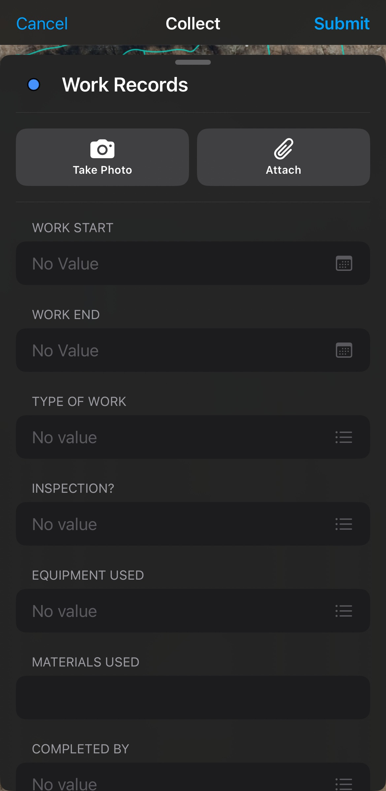
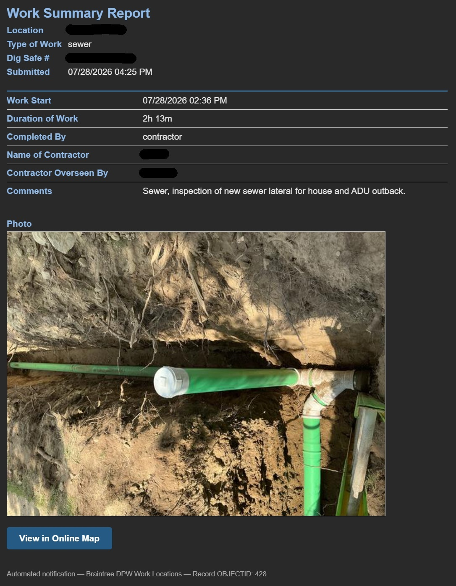
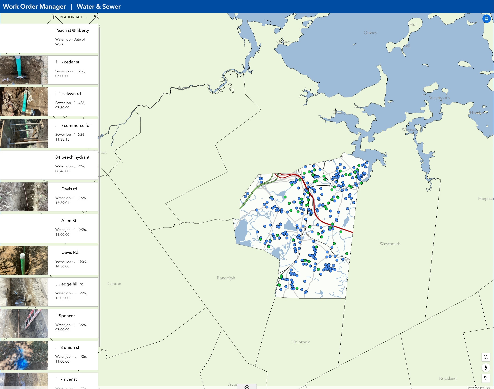

Aaron Portanova 
*August 2026*

# **Automating Workorders**

***Replacing a paper workorder loop with a Field Maps data model and an automated notification pipeline - so field crews record work once, in the field, and the office gets it without anyone driving a form across town.***

[← All Projects](README.md)

---

## Contents

| Section | Description |
|---|---|
| [Overview](#overview) | The problem and the shape of the solution |
| [The Paper Loop](#the-paper-loop) | What the process looked like before |
| [Data Model](#data-model) | Why one-to-many, and what it replaced |
| [Field Workflow](#field-workflow) | What crews actually do |
| [The Notification Pipeline](#the-notification-pipeline) | How records become emails |
| [Deployment](#deployment) | Running it on GitHub Actions |
| [What This Does and Doesn't Solve](#what-this-does-and-doesnt-solve) | Honest scope |
| [Lessons Learned](#lessons-learned) | What I'd tell someone building this |

---

## Overview

Like many municipalities, Braintree tracks workorders, permits, and billing across separate databases that don't talk to each other, and workorders themselves have historically moved on paper - multiple trips to the office to collect, process, and return information about work done by field staff. It's an awkward process with a single point of failure, since paper copies get lost or damaged along the way. In 2025 I began replacing that loop with an ArcGIS Online web map and Experience Builder app that field staff use to record the jobs they do each day.

The solution is built on a hosted feature layer with attachments enabled, so a worker can drop a point where the work was done and photograph the job or the paper workorder itself - the same way they already edit our GIS utility data in the field. A GitHub-based automation checks the layer for new records several times per day, pulls the details from them (work start/end, description, worker names, attachments) into an email, and sends it back to the office, where staff can read each job and click through to view its point on the map. That gives office staff a digital source to reference when entering work into the relevant database, removes the need to carry paper back and forth, and preserves the work on a map for future reference.

The design goal underneath all of it was to change as little about the crews' day as possible. Field staff already edit utility data in Field Maps on a town phone. Adding a workorder layer to the same app meant no new software, no new login, and no new habit to build - the adoption cost was close to zero, which is most of why it worked.

---

## The Paper Loop

The original process ran roughly like this: a workorder is generated in the office and printed. A crew picks it up, drives to the job, does the work, and writes the details on the paper. The paper rides in a truck for the rest of the day, comes back to the office at some point, and someone keys the contents into the appropriate system.

Every step in that chain is a place where information degrades. Paper gets wet, gets lost, or sits in a truck over a long weekend. Handwriting is interpreted rather than read. Nothing is timestamped except by whoever wrote a time down. And critically, there is no spatial record at all - the workorder says a street name, not a location, so six months later there's no way to answer "what did we do near this manhole?" without a filing cabinet.

The single point of failure is worth naming specifically: if the paper doesn't make it back, the work is effectively undocumented. The town did the work, paid for the work, and has no record of the work.

---

## Data Model

The first version of this used **Survey123**, which was the obvious choice - it's a form, and a workorder is a form. It also turned out to be the wrong choice, for a structural reason worth explaining.

A Survey123 submission is a flat record: one submission, one row. But a work location isn't a one-time event. Crews return to the same intersection, the same hydrant, the same service line repeatedly. Modeling each visit as an independent point produces a map that accumulates overlapping dots with no relationship between them, and no way to ask "what is the history of this location?"

I rebuilt it as a **one-to-many model** in Field Maps:

| Component | Contents | Relationship |
|---|---|---|
| **Work Locations** (feature layer) | Location description, type of work, Dig Safe number | The place |
| **Work Records** (related table) | Start/end time, workers, contractor, equipment, materials, inspection type, comments, photos | The visits |

A point is created once for a location. Every subsequent visit adds a related record to that point rather than a new point. The map stays legible, the history is queryable, and the parent record carries the context (where, what kind of work, Dig Safe reference) that would otherwise be re-typed on every single submission.

Migrating the existing Survey123 submissions meant moving both the attribute data and the photo attachments into the new structure, which I handled through ArcGIS Pro geoprocessing rather than by hand. Read about my [Extract BLOB](https://github.com/aaronportanova/gis-tools#extract-blob) project, which made this workflow possible.

---

## Field Workflow

A crew member opens Field Maps - the same app they already use for utility editing - drops or selects a work location, and adds a record for the visit. Fields are domain-driven wherever possible so the input is a tap rather than typing, which matters when the alternative is thumb-typing on a phone in the rain.

Photos attach directly to the record. In practice crews photograph two different things: the work itself (an exposed service, a completed repair, a trench before backfill), and, during the transition period, the paper workorder. That second one was an unplanned but genuinely useful pattern - it let crews adopt the digital system before the paper system was fully retired, rather than requiring a hard cutover.

An **Experience Builder** app wraps the map for office-side viewing, giving staff a filterable view of work locations and their full visit histories without needing Field Maps or ArcGIS Pro. The app's record list needed to show each visit's date and its photo inline, which turned out to be harder than expected - Experience Builder's Image widget can't follow attachments on a related record, and Arcade has no access to the viewer's session token by design. The fix was an Arcade expression that constructs the attachment REST URL directly from the related record's OBJECTID and attachment ID, authenticated with a narrowly scoped, view-only API key generated in the org's credential settings. That keeps the layer private to the organization while still letting the widget render the image.

---

## The Notification Pipeline

Collecting the data solves half the problem. The office still needs to *know* work happened, and staff aren't going to sit watching a map. So the second half of the project is an automation that turns new records into email.

The script polls the feature service on a schedule, finds records created within a lookback window, and for each one that hasn't already been sent:

1. Queries the related table for new work records.
2. Fetches the parent feature for location context - location description, type of work, Dig Safe number.
3. Pulls the first photo attachment, if any, and resizes it for email.
4. Builds an HTML summary with the parent context in a header block and every populated field in a two-column table. Blank fields are omitted rather than rendered empty, so a partially completed form still produces a clean report.
5. Sends it to the recipient list with the photo embedded inline and a button linking back to the online map.
6. Appends the record's OBJECTID to a tracking file so it never sends twice.

The deduplication deserves a note, because it's the part that took the most iteration. The lookback window and the tracking file solve different problems: the window keeps the query small and prevents a fresh deployment from emailing months of history, while the tracking file catches records that fall inside the window on two consecutive runs. Getting one of those right and not the other produces either duplicate emails or silently dropped records, and both failures are the kind that can erode trust in an automated system.

The full script and setup documentation are in [scripts/workorders](scripts/workorders/).

---

## Deployment

The automation runs on **GitHub Actions** rather than a server. Credentials for ArcGIS Online and the sending email account live as repository secrets; a cron-scheduled workflow installs dependencies, runs the script, and commits the updated tracking file back to the repository so state persists between runs.

Choosing Actions over a hosted server was mostly a municipal-IT decision. There is no VM to request, no server to patch, no service account tied to a machine someone might decommission. The whole thing is four secrets and a YAML file, and the run history is its own audit log - when someone asks whether an email went out, the answer is in the Actions tab.

The tradeoff is scheduling reliability. GitHub throttles aggressive cron schedules and delays scheduled jobs under load; a workflow set to run every five minutes may in practice fire hourly. I sized the lookback window generously to absorb that rather than fighting the scheduler, since a wide window costs nothing when deduplication is handled separately.

---

## What This Does and Doesn't Solve

It's worth being precise about scope, because the project is sometimes described as more than it is.

**What it solves:** work is recorded once, in the field, at the time it happens, with a location and a timestamp that aren't dependent on anyone's memory or handwriting. Nothing gets lost in a truck. The office learns about completed work the same day. There is now a permanent spatial record of what was done where.

**What it doesn't solve:** this does not integrate with the billing or permitting systems. Office staff still key the work into the relevant database - they're just keying it from a structured email and a map instead of from damp paper. Genuine system-to-system integration would require API access to systems that, in several cases, don't meaningfully offer it. That's the honest limitation, and it's the reason the deliverable is an email rather than a database write.

That's a deliberate stopping point rather than an unfinished one. The email is a format every downstream system can accept, because a person reads it.

---

## Lessons Learned

**Model the thing, not the form.** Survey123 was faster to build and structurally wrong. A workorder feels like a form, so a form tool feels correct - but the underlying entity is a *place with a history*, and flattening that away cost more to undo than it would have cost to model properly at the start.

**Meet crews where they already are.** The adoption argument that worked wasn't "this is better," it was "it's in the app you already have open." Every new app, login, or device is a reason not to use the system, and field staff have entirely reasonable reasons to distrust new office software.

**Let the transition be messy.** Photographing the paper workorder wasn't in any design document. It let crews use both systems simultaneously during the changeover instead of demanding a hard cutover, and it's probably the main reason the rollout didn't stall.

**Deduplication is the whole game in a polling system.** Duplicate notifications train people to ignore notifications. A missed record makes the system untrustworthy in a worse way. Both failure modes are quiet, and neither shows up in testing with three records.

**Boring infrastructure wins in a municipal context.** A cron job on a free tier with four secrets has survived longer than a server request would have taken to approve.

---

## Media

     
    Field Maps Form

 

     
    Email Example

 

     
    Web App Interface

 

---

[← All Projects](README.md)