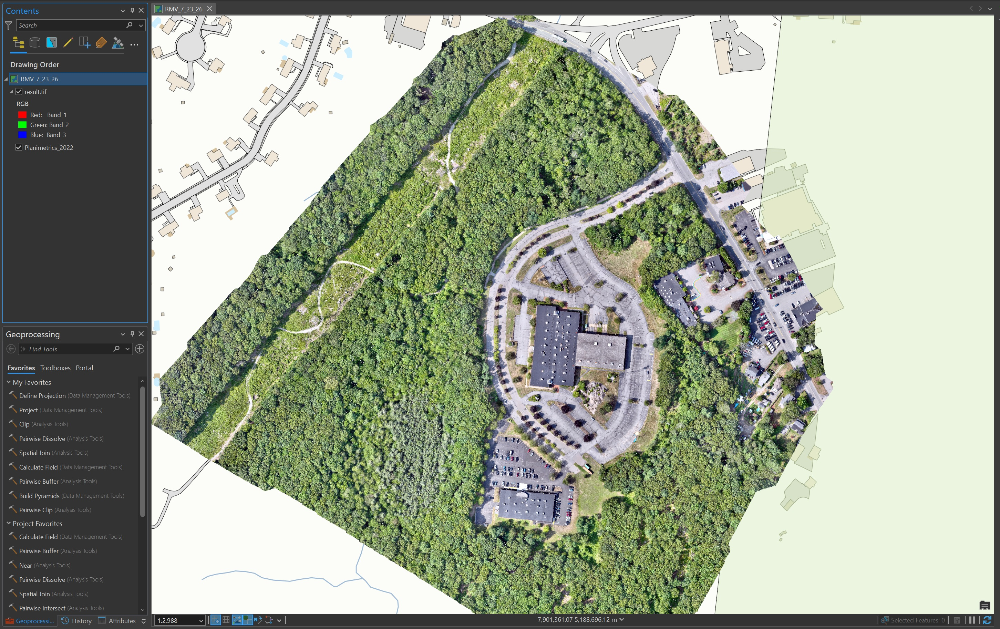
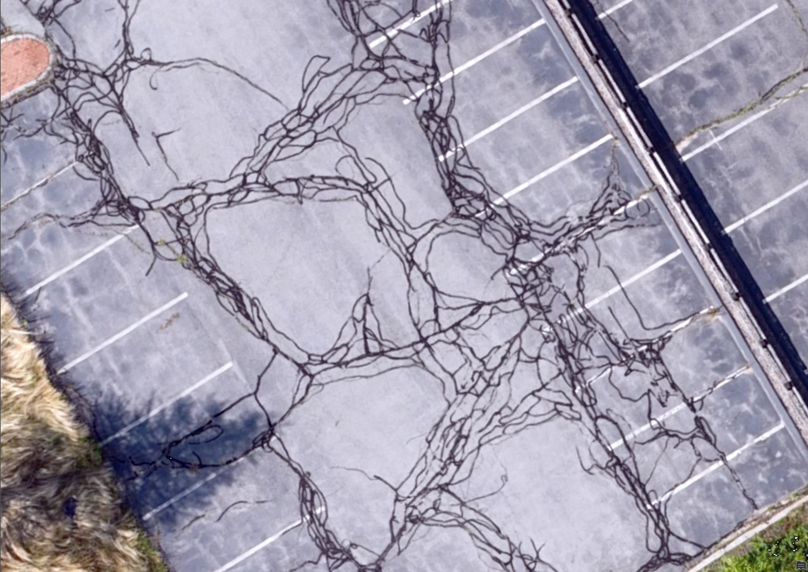
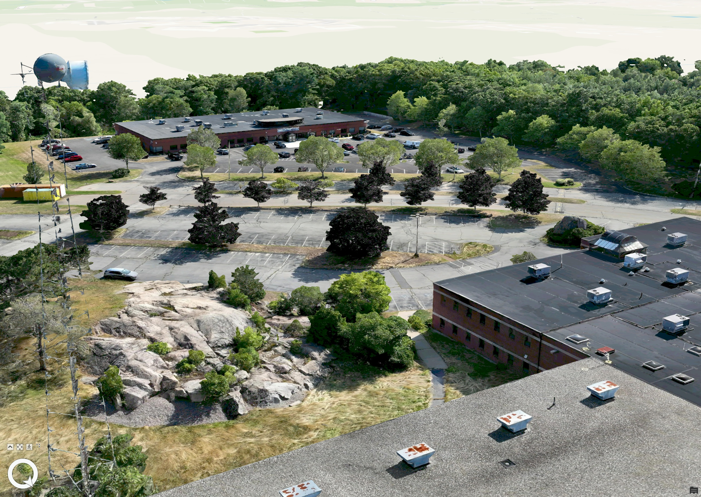

Aaron Portanova 
*August 2026*

# **Managing a Drone Program**

***Building a municipal sUAS program for the Town of Braintree Engineering Department - certification, equipment, processing workflow, and the "SOPs" that make it scalable beyond one pilot.***

[← All Projects](README.md)

---

## Contents

| Section | Description |
|---|---|
| [Overview](#overview) | What the program is and why it exists |
| [Certification and Authorization](#certification-and-authorization) | Part 107, LAANC, and flight authorization |
| [Equipment](#equipment) | Aircraft, sensors, and RTK positioning |
| [Capture Workflow](#capture-workflow) | Mission planning through flight execution |
| [Processing Workflow](#processing-workflow) | DJI Terra to ArcGIS Online |
| [Applications](#applications) | How the outputs actually get used |
| [Standard Operating Procedures](#standard-operating-procedures) | Documentation, checklists, and reporting |
| [Data Management and Retention](#data-management-and-retention) | Storage tiers, archiving, and FOIA obligations |
| [Lessons Learned](#lessons-learned) | What I'd tell someone standing one of these up |

---

## Overview

In 2025, I became interested in the application of drones to GIS. The ability to collect near-real-time, high-resolution aerial imagery is an invaluable tool for a municipal engineering department - it allows stakeholders to monitor site development at every stage, enables accurate digitization of visible assets like manholes and fire hydrants, and provides a way to build accurate 3D models that preserve a "digital twin" of a real-world scene.

Over 2025-2026 I built that interest out into an actual program: certification, equipment procurement, processing workflow, and written standard practices. The program produces 2D orthomosaics and 3D models used for site development monitoring, pre- and post-paving documentation, and locating buried infrastructure before it disappears under pavement - with results published through ArcGIS Online so the rest of the organization can use them without needing desktop GIS or photogrammetry software.

The distinction I've tried to hold onto throughout is between *flying a drone* and *running a program*. A single pilot with an aircraft can produce a nice orthomosaic. A program produces repeatable deliverables on a documented schedule, survives the pilot leaving, satisfies public records obligations, and has an answer for where the data lives in five years. Most of the work described below is in service of the second thing.

---

## Certification and Authorization

Operating a drone commercially on behalf of a government agency or company requires a remote pilot to hold an FAA Part 107 certification. In the fall of 2025, I enrolled in the sUAS Drone Certificate program at Bridgewater State University to build my understanding of drone operations, gain hands-on flight experience, and prepare for the Part 107 exam. I completed the program in the spring of 2026, earned my Part 107 certification (tested at Norwood Airport, certificate issued March 2026), and began developing the framework for a drone program on behalf of the Town of Braintree Engineering Department.

Part 107 is the operative rule set for commercial and government sUAS operations, and it governs the practical constraints the program runs under - visual line of sight, altitude ceilings, operations over people, and daylight/civil twilight limits.

Braintree's airspace situation makes authorization a routine part of mission planning rather than an afterthought. The northern section of Braintree is clipped by the Class B airspace around Logan International, so **LAANC** (Low Altitude Authorization and Notification Capability) approval is required to fly there. The process is straightforward: open a B4UFLY app like Aloft Air Control, draw a polygon where you will be flying, provide a max altitude for the mission (300 feet AGL there, as opposed to 400 feet AGL in uncontrolled airspace), and submit a LAANC approval request. Requests are almost instantly approved, and you're granted a several-hour window in which to conduct the flight.

Requesting authorization is built into the pre-flight checklist rather than handled ad hoc, and the LAANC approval number is recorded in the mission report for that flight.

---

## Equipment

In the spring of 2026, the Town purchased a **DJI Matrice 4E** - an RTK-enabled, survey-grade mapping drone built for high-accuracy GIS work and aerial mapping. The 4E was chosen over the thermal-equipped 4T after evaluating whether thermal use cases - roof moisture inspection, outfall monitoring, building envelope assessment - were likely to materialize often enough to justify the cost difference. They weren't, and a thermal platform can be rented for a specific project if that changes.

**RTK positioning** is the feature that matters most for the program's purpose. Massachusetts operates a statewide Real-Time Kinematic network, **MaCORS**, made up of base stations that stream real-time NTRIP corrections to RTK-capable survey devices like the M4E. This gives the drone sub-centimeter positional accuracy in ideal conditions (in practice, I typically see around 0.6" horizontal accuracy reported in the field), enabling precise georeferencing of the captured aerial imagery.

The practical consequence is that orthomosaics land in the correct real-world position without a ground control point network, which removes the single most labor-intensive step from a traditional photogrammetry workflow. For municipal work - where the deliverable needs to line up against existing parcel, utility, and roadway data - that positional fidelity is the whole point.

The department also operates two **Emlid Reach RX** RTK GNSS receivers connected to the MaCORS network over NTRIP, used with ArcGIS Field Maps for ground-based feature collection. These are documented separately under [Using a Survey Grade GPS](USING_GPS.md), but the two efforts are complementary: aerial capture for surface conditions and extents, ground survey for precise point features and anything under canopy.

---

## Capture Workflow

Mission planning starts from the extent of interest and works backward to flight parameters. Altitude, overlap, and flight pattern are selected based on the deliverable - a 2D orthomosaic for paving documentation tolerates different settings than a 3D mesh of a structure.

A representative mapping mission runs at roughly **150-200 ft AGL with 80% front and 75% side overlap**, which for a large site (~100 acres) produces several hundred images. Higher overlap improves reconstruction quality (particularly for 3D) at the cost of flight time, battery swaps, image count, and downstream processing hours, so the setting is a deliberate trade rather than a default. A fully charged battery allows for roughly 40 minutes of flight time, so three fully charged batteries is sufficient for most missions - mapping a few hundred acres in 2D, or collecting many close-up photos of a structure for a high-resolution 3D model.

Pre-flight follows a written checklist covering airspace authorization, weather and wind limits, battery state, storage capacity, RTK fix confirmation, and a brief site survey for obstructions and non-participating people. Post-flight, imagery is offloaded from the aircraft and the mission is logged.

---

## Processing Workflow

Imagery is processed in **DJI Terra**, which handles DJI's RTK metadata and camera lens profiles natively - a meaningful convenience, since it removes the guesswork of manually specifying sensor parameters. Our purchase of the Matrice 4E came with a 1-year subscription to Terra, and so far it's been rock solid.

Turnaround time depends on the scale and the product. Once Terra processing is complete, I bring the 2D or 3D product into ArcGIS Pro, clip to an area of interest if needed, project to Web Mercator (Auxiliary Sphere), and publish to ArcGIS Online for sharing with others.

**For 2D deliverables**, Terra outputs a georeferenced orthomosaic as GeoTIFF, along with a DSM and/or point cloud if selected during processing. These process relatively quickly - turnaround is typically same-day.

**For 3D deliverables**, Terra produces a textured mesh, and the reconstruction is considerably more time-consuming depending on image count and scene complexity. I'll typically start a 3D reconstruction at the end of the day and leave my computer on overnight. The mesh is published to ArcGIS Online as an **I3S / Scene Layer Package (SLPK)**, which renders in Scene Viewer and ArcGIS Pro Local Scenes without requiring anyone downstream to install photogrammetry software.

A lighter-weight alternative I sometimes use where a full mesh isn't warranted: load the DSM as an elevation surface in a Pro Local Scene and drape the orthomosaic over it. That produces most of the visual value of a 3D product with none of the mesh processing cost.

Publishing to ArcGIS Online is what actually makes the program useful to the rest of the organization - engineering staff, other departments, and in some cases the public can view results in a browser rather than requesting a file.

---

## Applications

**Pre- and post-paving documentation.** One recurring use is flying over streets ahead of paving projects to document pre-paving conditions - recording the position of surface features like trench cuts, structure rims, and utility markings that become invisible once new pavement goes down. This has proven to be one of the highest-value applications, because the alternative to having the imagery is excavation or guesswork.

**Locating buried infrastructure.** I've also flown over streets following infrastructure work - lead service line renewals, water and sewer main replacements - to capture the locations of trenches that are still visible once they've been asphalted over. This helps digitize the true locations of mains and services on our GIS utility layers, rather than relying on as-builts of varying quality.

**Site development monitoring.** I've flown over development projects in Braintree before, during, and after construction, producing 2D orthomosaics and 3D models that I share with the rest of the organization through ArcGIS Online. This lets stakeholders visualize progress and measure volumes and areas to verify reported figures, informs meeting discussions, and gives people visibility into a site without requiring an in-person visit.

**General base imagery.** Current, high-resolution, correctly-positioned imagery of town facilities and sites is broadly useful for engineering work in ways that are hard to predict in advance - which is an argument for capturing more than the immediate need.

---

## Standard Operating Procedures

At the moment this is a solo venture, but these procedures are intended to be scalable to potential future remote pilots who fly on behalf of Braintree Engineering. The file structure, mission report template, and data maintenance standards are all easy to copy from one user's machine to another.

A program that lives entirely in one person's head produces good results right up until that person is unavailable, and then produces nothing. Documented procedures mean a future remote pilot can be brought into the program and produce consistent deliverables without reverse-engineering someone else's habits.

### File Structure

I maintain a specific file structure for drone operations - a consistent directory scheme per mission, so raw imagery, processing intermediates, and final deliverables are always in predictable locations regardless of who set up the project.

### Pre-Flight Checklist

Before every flight, I refer to a pre-flight checklist I put together based on the standards specified in FAA Part 107 documentation. Copies of this checklist are printed and stored in the drone case for convenient field access.

### Mission Report

After every mission, I fill out a mission report titled with a date/time stamp and project description. The report is generated from a standard template with entry fields for date/time, location, mission summary, pilot name, Part 107 certification number, weather, cloud cover, LAANC number (if applicable), authorized and flown altitudes, data storage location for the project, and general comments. This creates a consistent, auditable record of every flight regardless of who flew it.

### LAANC Approval

Since the northern part of Braintree lies within controlled airspace, LAANC approval is required before flying in that area. A maximum altitude of 300 feet is permitted there, compared to 400 feet in uncontrolled airspace, and approval can be obtained in real time through a LAANC-enabled app such as Aloft Air Control. Once a LAANC approval number is received, it's recorded in the mission report for that mission.

### Data Maintenance Standards

Due to FOIA requirements, drone data must be retained for 7 years. Drone data - images, 4K video - can quickly take up significant disk space, so I added a 4TB SSD to my laptop as a dedicated GIS and drone data drive, and offload all data to a mission folder on this drive after each flight. Once offloaded, I make a second copy to a high-capacity external archive drive for redundancy.

---

## Data Management and Retention

Drone programs generate data volume faster than most municipal GIS workflows, and the 7-year FOIA-driven retention requirement means the answer to "can we delete this?" is usually no. That forced an explicit archiving strategy rather than an accumulating pile on a network share.

I triage mission data into three tiers:

| Tier | Contents | Treatment |
|---|---|---|
| **Irreplaceable** | Raw imagery, flight logs | Archived permanently; cannot be regenerated at any cost |
| **Expensive to reproduce** | Orthomosaics, DSMs, SLPKs, point clouds | Archived; regenerable from raw, but at significant processing time |
| **Disposable** | Processing intermediates | Deleted after deliverables are verified |

Cold storage is handled through external SSDs purchased annually, with the broader archiving framework developed alongside the town's IT department. The strategy is deliberately boring - the failure mode for drone data isn't exotic, it's simply running out of room and making bad deletion decisions under pressure.

---

## Lessons Learned

**The certification is the easy part.** Part 107 is a real exam requiring real study, but it's bounded and finite. Building the workflow, documentation, and data strategy around it took substantially longer and mattered more.

**Decide where the data lives before you generate any.** Retention obligations and file sizes are both known in advance. Working out the archiving approach after accumulating a few terabytes is meaningfully harder than working it out first.

**RTK earns its cost in workflow, not just accuracy.** The positional accuracy is the headline, but the practical value is eliminating ground control point placement - which is what actually determines whether a capture is a half-day job or a two-day job.

**Publish, don't distribute.** Handing colleagues a GeoTIFF creates a support obligation and immediately produces version drift. Publishing to ArcGIS Online means one authoritative copy, viewable in a browser, that stays current.

**Write it down while you're still the only pilot.** Documenting a solo operation feels like overhead right up until someone else needs to fly, at which point it's the difference between onboarding and starting over.

---

## Media

     
    Orthomosaic of the RMV Site

 

     
    Zoomed to a section of parking lot

 

     
    3D model of the RMV site

 

<!-- pre / post paving , in-person photo of drone being used.. -->

---

[← All Projects](README.md)