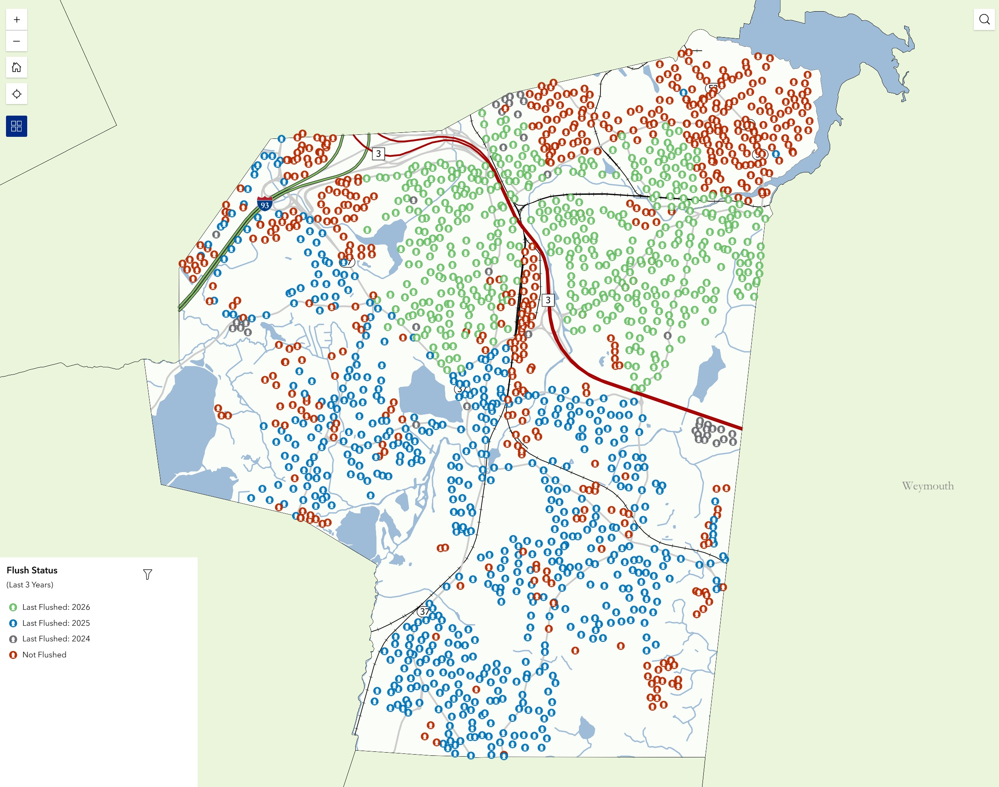

Aaron Portanova<br>
*August 2026*

# **Monitoring Hydrant Flushing**

***An ArcGIS Online solution for tracking fire hydrant flushing and service history - a one-to-many data model, a Field Maps form, live symbology showing flushed vs. not-flushed hydrants, and a public-facing viewer.***

[← All Projects](README.md)

---

## Contents

| Section | Description |
|---|---|
| [Overview](#overview) | What the solution does and why it exists |
| [Why Flushing Gets Tracked](#why-flushing-gets-tracked) | The operational driver |
| [Talking to the Field First](#talking-to-the-field-first) | Requirements gathering before architecture |
| [Data Model](#data-model) | One-to-many, and the schema alignment behind it |
| [Field Workflow](#field-workflow) | What crews do on a flushing day |
| [Storing Flush Dates](#storing-flush-dates) | Why the date is duplicated on the parent |
| [Live Flush Status Symbology](#live-flush-status-symbology) | Making the map self-updating |
| [Other Views of the Same Data](#other-views-of-the-same-data) | Condition, service, pressure, manufacturer |
| [A Second Audience](#a-second-audience) | Potential Fire Department use |
| [Lessons Learned](#lessons-learned) | What I'd tell someone building this |

---

## Overview

In 2024 I began developing an ArcGIS Online solution for monitoring fire hydrant flushing operations for the Town of Braintree's Water and Sewer department. Field workers needed a way to visualize and track flushing on a map, store multiple service records per hydrant over time, and see at a glance which hydrants had been flushed and which hadn't. I worked closely with field staff to understand their needs before creating a solution intended to serve them in the field as well as office staff reviewing the work afterward.

The result lets staff view hydrants by flush status, condition, service status (in or out of order), pressure, manufacturer, and other properties. That same information has obvious value beyond the department that collects it - hydrant operation status and pressure are exactly what the Fire Department would want during a response - which is the basis of a proof of concept I've put together for them, described below.

The technically interesting part is the data model: hydrants accumulate service history, and a system that only stores "the last thing that happened" throws away the record that makes the asset understandable a decade later.

---

## Why Flushing Gets Tracked

Hydrants get flushed on a recurring cycle to move sediment and mineral buildup out of the water main network, verify that each hydrant actually operates, and confirm water pressure. Flushing a hydrant does two things: it checks the water quality at that hydrant (pressure, flow), and it inspects the asset (hydrant) itself. A crew opening a hydrant learns whether it's operational (or rusted shut), whether the caps come off, whether it drains, and roughly what pressure it delivers - all information nobody else in the organization is in a position to collect.

Before this system existed, that information was either not collected, or if it was, it only lived in a foreman's memory or on paper. Tracking it in GIS means the observation is captured once, when it's made, and stays permanently attached to the asset.

---

## Talking to the Field First

I spent time with our water and sewer field crew before designing anything, and the requirements that came out of those conversations shaped the design and functionality of the solution:

- **It has to work on a map.** Crews think in routes and streets, not record IDs. The primary interface needed to be the hydrant on the map, not a form in a list.
- **One hydrant, many visits.** Overwriting last year's flush with this year's is useless, because information is lost.
- **"Serviced" and "flushed" are not the same thing.** A crew might visit a hydrant, work on it, and not flush it. Any status that treats a visit as a flush would be wrong.
- **At-a-glance status matters more than reports.** The real question in the morning is "what haven't we hit yet this year," and the answer should be visible on the map without running anything.
- **It has to be fast.** If recording a flush takes longer than flushing the hydrant, crews won't use it.

That last point drove more of the form design than anything else.

---

## Data Model

The solution uses a **one-to-many** structure: a `Water_Hydrants` point feature layer as the parent, and a related `Water_Hydrant_Records` table holding one row per service visit, joined through a relationship class.

This mirrors the pattern I've since reused across Braintree's maintenance data - the same shape as the [workorder system](AUTOMATING_WORKORDERS.md) and the stormwater inlet inspection records. The parent feature carries the *identity and current state* of the asset: location, manufacturer, size, condition, service status, and a small number of fields describing the most recent activity. The related table carries the *events*: flush date, whether the hydrant was actually flushed, pressure observations, crew notes, and attachments.

Getting there required designing a custom schema, which served as the foundation used across all other asset layers. That work was done manually in ArcGIS Pro, because the process involved preserving existing GlobalIDs, populating `ParentGlobalID` on the records table via a join and field calculation, and then formalizing the link with a new relationship class. GlobalID manipulation is exactly the kind of thing that will usually fail if you try to script it, because GlobalIDs are system-managed. Doing it by hand kept every step visible and verifiable through the process.

A note for anyone attempting the same thing: build the relationship *last*. Establish the key values first, confirm they're correct, then create the relationship class on top of data you already trust.

---

## Field Workflow

Crews work in **ArcGIS Field Maps** on a town-issued iPad. On a flushing day the workflow is:

1. Go to the hydrant, tap it, perform the flush.
2. In Field Maps: turn on the Water layers, tap the hydrant, add a related record from the hydrant's popup - the form captures the date, whether the hydrant was flushed, pressure and condition observations, and any notes.
3. Attach a photo, submit the form.

The form is intentionally short. Coded value domains handle most fields so entry is tapping rather than typing, and the fields that matter most (flush date and the flushed yes/no) are the first things on the form.

Positional accuracy improves as a side effect. When crews are already at a hydrant with the [Emlid Reach RX](USING_GPS.md) paired to Field Maps, they can correct a hydrant sitting a few meters off in the data to where it actually is, which pays off later when the hydrant is buried by snow.

---

## Storing Flush Dates

Storing history in a related table solves the record-keeping problem but creates a display problem: symbology and popups on the parent layer can't easily reach into related records. A Date field therefore had to be duplicated: `Service Date` in the related records table, and `Last Flush Date` on the feature itself. This is the only way to symbolize "which hydrants have been flushed in the last year", without delving too deeply into Arcade calculated expressions on the form itself. I attempted this, but since `Last Flush Date` is a required field by design (to ensure symbology is always correct), field workers ran into submission errors when creating new hydrant points that didn't exist on the map yet, so I scrapped it.

Something worth flagging: **calculated expressions configured in Field Maps don't backfill, they only fire when a record is created or edited**. Populating history across the whole hydrant layer means running the same logic through the Calculate Field tool in ArcGIS Pro. I'll do this periodically to catch any missed `Last Flush Date` entries.

---

## Live Flush Status Symbology

To show flush status, an Arcade expression is used instead of a stored field. This allows symbol classes to be created for `Flushed`, `Not Flushed`, and `Out of Service`.

```
// Get the current date
var currentDate = Date();

// Get the flush date and service_status field from the feature
var flushDate = $feature.flushdate;
var serviceStatus = $feature.service_status;

// Calculate the date one year ago
var oneYearAgo = DateAdd(currentDate, -1, 'years');

// Check if the service_status is "Out of Service" from the domain values
if (serviceStatus == "Out of Service") {
    return "Out of Service";
}

// Check if flushDate is within the last year
if (flushDate >= oneYearAgo && flushDate <= currentDate) {
    return "Flushed";
} else {
    return "Not Flushed";
}
```

A public [Hydrant Flush Status Viewer](https://experience.arcgis.com/experience/1303066f31c3400386e07b6fea2a3e61) symbolizes them slightly differently, to share flushing operations in the last 3 years with the community:

```
var flushDate = $feature.flushdate;

if (IsEmpty(flushDate)) {
    return "Not Flushed";
}

var flushYear = Year(flushDate);
var currentYear = Year(Now());

// Keep the three most recent calendar years, including the current
if (currentYear - flushYear <= 2) {
    return "Last Flushed: " + Text(flushYear);
}

return "Not Flushed";
```

These symbologies allow hydrants to roll themselves from "Flushed" to "Not Flushed" as their flush anniversary passes, or to calculate the last flushed year, with no annual reset step.

---

## Other Views of the Same Data

The same layer supports several other symbologies and filters that draw on attributes collected during the same field visits:

| View | What it answers |
|---|---|
| Flush status | What's been done this cycle, what hasn't |
| Condition | Which hydrants are deteriorating and may need replacement |
| Service status | Which hydrants are out of order and shouldn't be relied on |
| Pressure | Where flows are unusually high or low |
| Manufacturer / model | What is needed for a repair |

Because these all live on the same features, switching between them is a symbology change rather than a separate dataset. That matters for maintenance: one authoritative hydrant layer, many views.

---

## A Second Audience

A potential second audience for this data is the Fire Department, as a side effect of maintenance tracking. Fire response cares about things that are stored in this system: **is this hydrant in service, and is it high or low pressure?** Both are captured routinely by water crews as a byproduct of flushing. Sharing the hydrant layer with the Fire Department would mean their picture of the system stays current without anyone maintaining a parallel dataset, and without the water department taking on a new reporting obligation.

This currently exists as a proof of concept rather than an operational tool. The Fire Department isn't using it day to day, and adopting it would involve conversations about access, training, and how it fits alongside the systems they already rely on during a call. The point of building the demonstration was to show what's already possible with data the town is collecting anyway.

It's a reminder that in a municipality, the person collecting the data and the person who might benefit the most from it might not frequently work together, or know what tools already exist that could help them.

---

## Lessons Learned

**Ask what "done" means before designing the schema.** The serviced-versus-flushed distinction sounds like a detail. It's actually the difference between a status field that's trustworthy and one that people ignore.

**Related tables are the right default for anything recurring.** The temptation is always to put `last_flush_date` on the asset and move on. That's simpler for about a year, and then someone asks how often a problem hydrant has been visited and there's no answer. Store the events and derive the summary later.

**Manual is sometimes the professional choice.** The geodatabase restructuring might have been able to be scripted, but arcpy tools frequently recalculate GlobalIDs even when you expect them not to. Doing it by hand is safe and immediately verifiable, so no time is wasted redoing something ten times.

**Design the form for the worst conditions.** Every field the crew has to type is a field that gets skipped at 2am with wet gloves on. Domains, defaults, and a short form beat a comprehensive one that goes half-filled.

**Maintenance data can have multiple use cases.** Building this for the water department produced something the Fire Department could use. Whether they adopt it is a separate question, but it's worth asking for any dataset.

---

## Media

<div align="center">
    <br>
    Public Hydrant Flush Status Viewer
</div><br>

---

[← All Projects](README.md)